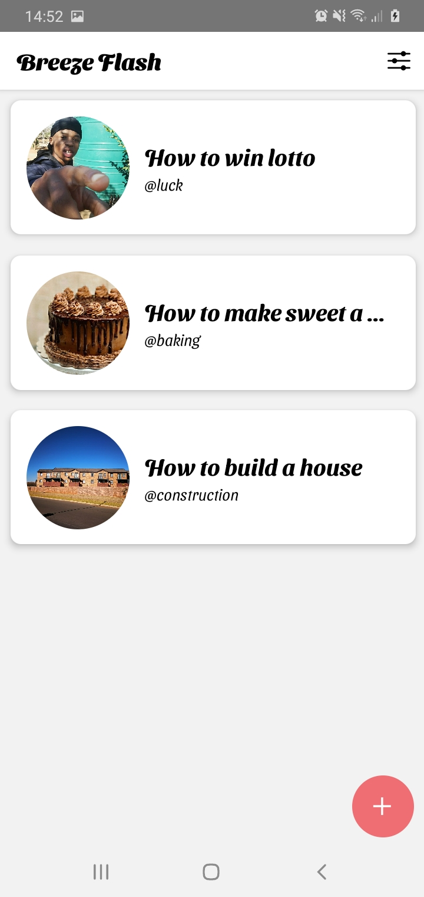
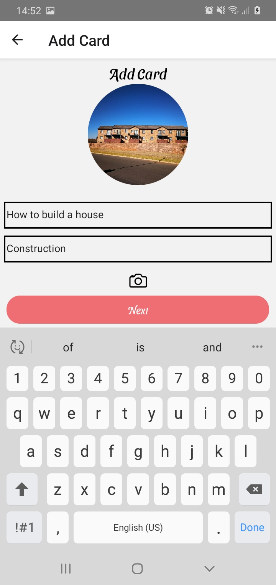
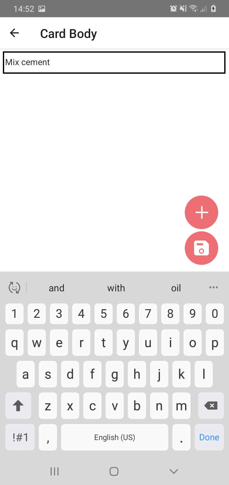

<h3 align="center">Hi there 👋 I am Samuel Mothwa</h3>

  

  

  
  
  

 <h2>My Github Status  🚀 </h2>

  

  <h2>Most use languages ⚖️ </h2>

  

### Web Apps
#### [Sabaweli Education](https://sabaweli.xyz)
Sabaweli Education is a platform for students to laverage thier studies and keep a constince record. Some of the features are listed below
**Features**
- Video/Audio to text/notes
- Study coach
- Question Answer helper

##### Video/Audio

Upload a lecture video or audio the app with transcribe it and return back the notes/text

##### Study Coach
Record your study activity and see the process per topic/subject to have a consistnce pattern or growth

##### Question and Answer helper
upload or enter a text/phassage and ge point based on the question you want to extract use the points and study key features for quick reference

### Apps in React Native

#### Kulture
Kulture is an application written in React Native that allows users to upload images and follow aother users and also message using the global group chat

	  
  	
    	
    	
	
	
	
	
	

### Download

#### Kleva Shoppa
Kleva shoppa is product price comaprison application where you can see store products with price. See porpular shops in South Africa

	
	

### Download

#### Ultimate News

The Ultimate News is a news application platform for headlines all around the world

#### Website
[The Ultimate News](https://www.theultimatenews.xyz/)

#### Web App
[The Ultimate News](https://app.theultimatenews.xyz/login)

### Mobile App Download

#### Couch Buddies

Movie recommendations application. You can search for movie and view the top picks and the most trending movies currently

    
    
    

#### Download

#### Breeze Flash

Add TODO cards, in a flash card format

    
    
    

#### The Expensor

The Expensor is Transactions visialization Application that uses the Device SMS.The application access the SMS and takes transactions SMS specific 

    
    
    

