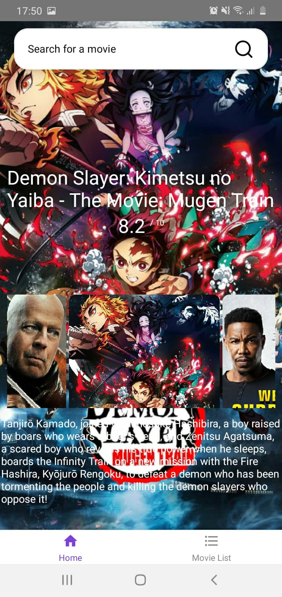

<h3 align="center">Hi there 👋 I am Samuel Mothwa</h3>

  

  

  
  
  

### Apps in React Native

#### Ultimate News

Ultimate News is a React Native (bootstraped with expo) application. It loops through a list of news headline article base on the South African content. It uses the [news.org](news.org) API data

		  
  	
    

### Download

#### Couch Buddies

    
    
    

#### Download

#### The Expensor

The Expensor is Transactions visialization Application that uses the Device SMS.The application access the SMS and takes transactions SMS specific 

    
    
    

### YouTube Downloader

A youtube downloader (electron) desktop application , which you download youtube video and youtube playlist

  
    

